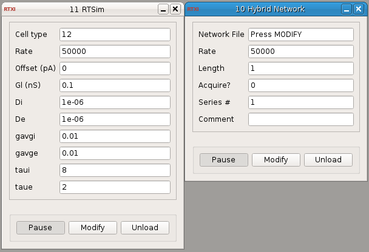

###GenNet: A platform for Hybrid Network Experiments

**Requirements:** All required components included.  
**Limitations:** None noted.  
**Authors:** Tilman Kispersky, Michael Economo, Pratik Randeria, John A. White   

This plugin implements a framework for Hybrid Network experiments. Hybrid networks entail the coupling of biological circuit elements with simulated ones. Hybrid Network experiments have been historically hindered by the difficulty of implementing the network. This software package aims to address this problem by providing tools that allow for the automatic setup of the simulated portion of the network and by automating integration of biological neurons with simulated neurons.

The downloaded code contains 3 components organized into 3 directories:

\- GenNet   
|- Hybrid Network  
|- RTSim  
|- StandAloneSim  
|- MatlabScripts  

Each of these three directories contains code to run a particular realization of the software.

‘Hybrid Network’ provides an RTXI interface to our simulator and performs the classical function of a hybrid network by coupling one or more biological neurons with one or more simulated neurons.

‘RTSim’ provides a stripped down version of a Hybrid Network in which there is only one simulated neuron. Running the software in this mode is useful for performing an interactive exploration of the behavior of one model neuron in real time when used in conjunction with other RTXI plugins such as those used for standard electropyhisiology experiments. For example, the response of a model neuron can be assessed in response to step-current injection using the IStep plugin.

Finally, because the core of GenNet implements a network simulation framework, the software can be used as a stand-alone network simulator that does not depend on RTXI. Compiling the code in the ‘StandAloneSim’ directory will accomplish this task.

The ‘MatlabScripts’ directory contains example code to demonstrate how to read output data, automatically generate Netfiles and a simple GUI program to automate data plotting.

Detailed instructions for installing, running and using GenNet can be found in our upcoming paper describing the design and implementation of the software as well as providing several practical examples of use cases. 
